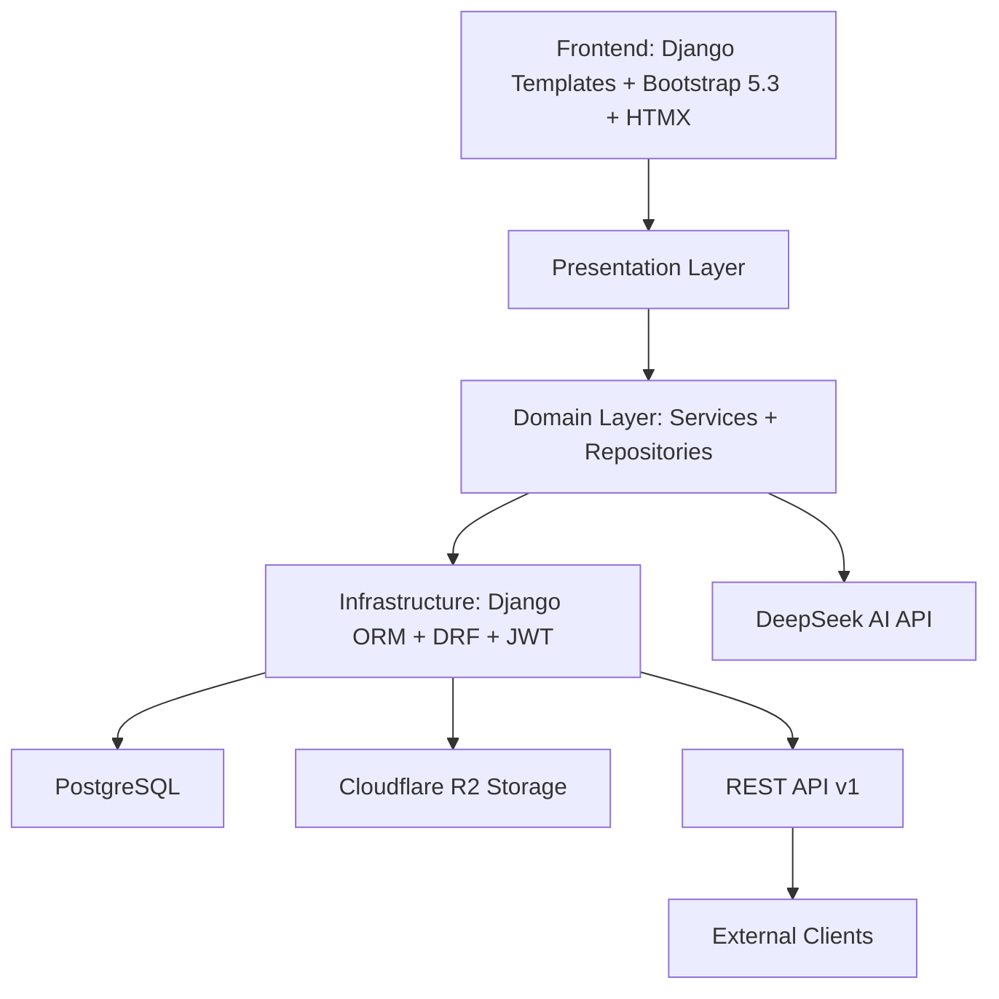

<div align="center">


</div>

<br>

# 🐻 Winnie — Gestión de Proyectos Scrum

> Sistema completo de gestión de proyectos ágil con **roles jerárquicos**, **tablero Kanban drag-and-drop**, **sprints**, **backlog**, **reclutamiento con IA**, **portal de clientes** y **asistente inteligente DeepSeek**.

<br>

## 🚀 Funcionalidades

### 🎯 Scrum
| Funcionalidad | Descripción |
|---|---|
| **Tablero Kanban** | Drag-and-drop con columnas Por Hacer / En Progreso / Testing / Completado |
| **Backlog** | Priorización visual de tareas con filtros, búsqueda y ordenamiento |
| **Sprints** | Creación, inicio, completado automático. Solo un sprint activo por proyecto |
| **Burndown** | Visualización de progreso del sprint |
| **Calendario** | Vista de sprints con fechas de inicio y fin |
| **Reportes** | Gráficas por estado, prioridad, tipo y distribución de carga |

### 👥 Recursos Humanos
| Funcionalidad | Descripción |
|---|---|
| **Gestión de equipo** | Roles jerárquicos, asignación de áreas y especialidades |
| **Reclutamiento IA** | Postulantes se registran, la IA analiza perfiles y sugiere candidatos |
| **Suplencias** | Delegación temporal de responsabilidades entre miembros |
| **Perfiles** | Foto, tecnologías dominadas, especialidad, estado (activo/vacaciones/licencia) |

### 🏢 Portal del Cliente
| Funcionalidad | Descripción |
|---|---|
| **Solicitudes de servicio** | Clientes crean tickets con detalle y prioridad |
| **Seguimiento** | Visualización de estado de solicitudes y proyectos activos |
| **Documentos** | Subida y descarga de archivos por proyecto |

### 💬 Colaboración
| Funcionalidad | Descripción |
|---|---|
| **Chat en tiempo real** | Mensajería instantánea entre miembros del equipo |
| **Comentarios** | Discusiones en tareas y proyectos |
| **Notificaciones** | Alertas de cambios, asignaciones y menciones |
| **Documentos** | Repositorio de archivos por proyecto con Cloudflare R2 |

### 🤖 Inteligencia Artificial
| Funcionalidad | Descripción |
|---|---|
| **Asistente DeepSeek** | Chat contextual con IA integrada para consultas del equipo |
| **Filtro de reclutamiento** | Evaluación automática de perfiles de candidatos |

### 🔒 Seguridad y Auditoría
| Funcionalidad | Descripción |
|---|---|
| **RBAC** | Control de acceso basado en 6 roles con permisos granulares |
| **Autenticación JWT** | API REST protegida con tokens JWT + refresh |
| **AuditLog** | Registro completo de acciones de usuarios en el sistema |
| **Registro por aprobación** | Flujo de 3 pasos para nuevos miembros con validación admin |

<br>

## 🎭 Roles del Sistema

| Rol | Permisos |
|---|---|
| 🔴 **Super Admin** | Acceso total: CRUD global, asignar roles, gestión completa del sistema |
| 🟠 **Admin** | Gestión de usuarios, áreas, especialidades y recursos |
| 🟣 **Jefe de Área** | Administración de proyectos, equipo y sprints de su área |
| 🟢 **Jefe de Proyecto** | Gestión de su proyecto: tareas, sprints, miembros y documentos |
| 🟡 **Miembro** | Interactúa con tareas asignadas, Kanban y colaboración |
| 🔵 **Cliente** | Portal de autoservicio: solicitudes, seguimiento y documentos |

<br>

## 🧱 Stack Tecnológico



| Capa | Tecnologías |
|---|---|
| **Backend** | Django 5.x · Python 3.12+ |
| **API REST** | Django REST Framework 3.16 · SimpleJWT |
| **Base de Datos** | PostgreSQL |
| **Frontend** | Django Templates · Bootstrap 5.3.3 · Font Awesome 6.5 · HTMX |
| **Almacenamiento** | Cloudflare R2 (compatible S3) |
| **IA** | DeepSeek API (modelo de lenguaje) |
| **Email** | Resend (envío transaccional) |
| **Despliegue** | Railway · Gunicorn · Nginx |
| **Arquitectura** | Clean Architecture (domain / infrastructure / presentation) |

<br>

## 🏗️ Arquitectura

```
winnie_scrum/
├── config/                       # Configuración Django
│   ├── settings/
│   │   ├── base.py               # Settings compartidos
│   │   ├── local.py              # Entorno desarrollo
│   │   └── production.py         # Entorno producción (Railway)
│   └── urls.py
├── apps/core/
│   ├── domain/                   # 🧠 Capa de Dominio
│   │   ├── models/               # Entidades y reglas de negocio
│   │   ├── services/             # Casos de uso (permission, task, sprint, project...)
│   │   └── repositories.py       # Interfaces (puertos)
│   ├── infrastructure/           # 🔧 Capa de Infraestructura
│   │   ├── models/               # Modelos ORM de Django
│   │   ├── repositories/         # Implementaciones concretas
│   │   ├── api/                  # API REST (serializers, viewsets, permissions)
│   │   └── migrations/           # Migraciones de base de datos
│   ├── presentation/             # 🎨 Capa de Presentación
│   │   ├── views/                # Vistas modulares por entidad
│   │   ├── templates/            # Templates HTML + partials HTMX
│   │   ├── static/               # CSS, JS, imágenes
│   │   ├── middleware.py         # Control de sesión, auditoría
│   │   └── urls.py
│   ├── templatetags/             # Template tags personalizados
│   └── tests/                    # ✅ 253 tests
│       ├── test_models.py
│       ├── test_services/        # Tests de lógica de negocio
│       ├── test_views/           # Tests de vistas y templates
│       ├── test_api/             # Tests de API REST
│       └── test_templatetags/
├── docs/                         # Documentación
│   ├── API_V1.md                 # Documentación completa de la API REST
│   ├── casos_de_uso.md           # Catálogo de casos de uso
│   └── procesos/                 # Flujos de negocio
├── scripts/                      # Scripts de sincronización y cifrado
├── requirements.txt
└── manage.py
```

<br>

## ⚡ Inicio Rápido

### Requisitos
- Python 3.12+
- PostgreSQL
- Git

### Instalación

```bash
# 1. Clonar
git clone https://github.com/kevinatahualpa/winnie_scrum.git
cd winnie_scrum

# 2. Entorno virtual
python3 -m venv venv
source venv/bin/activate

# 3. Dependencias
pip install -r requirements.txt

# 4. Configurar .env
cat > .env << EOF
SECRET_KEY=dev-key-cambiar-en-produccion
DEBUG=True
DB_NAME=winnie_db
DB_USER=postgres
DB_PASSWORD=postgres
DB_HOST=localhost
DB_PORT=5432
EOF

# 5. Base de datos
sudo -u postgres psql -c "CREATE DATABASE winnie_db;"

# 6. Migraciones
python3 manage.py migrate

# 7. Datos de prueba
python3 manage.py seed

# 8. ¡Ejecutar!
python3 manage.py runserver
```

Abrir `http://127.0.0.1:8000`

<br>

## 🔑 Credenciales de Prueba

| Email | Contraseña | Rol |
|---|---|---|
| `super@gmail.com` | `123456` | 🔴 Super Admin |
| `admin@gmail.com` | `123456` | 🟠 Admin |
| `jefe.areas@hackthony.com` | `area123` | 🟣 Jefe de Área |
| `jp.miguel@hackthony.com` | `jp123` | 🟢 Jefe de Proyecto |
| `pedro@hackthony.com` | `member123` | 🟡 Miembro |
| `cliente@hackthony.com` | `cliente123` | 🔵 Cliente |

<br>

## 📡 API REST

Winnie expone una API REST versionada con autenticación JWT.

```bash
# Obtener token
curl -X POST http://127.0.0.1:8000/api/v1/auth/token/ \
  -H "Content-Type: application/json" \
  -d '{"username":"admin@gmail.com","password":"123456"}'

# Listar proyectos
curl http://127.0.0.1:8000/api/v1/projects/ \
  -H "Authorization: Bearer <access_token>"
```

📖 Documentación completa: [`docs/API_V1.md`](docs/API_V1.md)

<br>

## ✅ Tests

```bash
# Todos los tests
python3 manage.py test apps.core.tests -v 2

# Solo API REST
python3 manage.py test apps.core.tests.test_api -v 2

# Solo servicios (lógica de negocio)
python3 manage.py test apps.core.tests.test_services -v 2
```

> **253 tests · 0 fallos · Cobertura de modelos, servicios, vistas y API REST**

<br>

## 🚢 Despliegue (Railway)

El proyecto está desplegado en producción en Railway con:

- **App**: `winnie_scrum`
- **Dominio**: `winniepm.xyz`
- **Servidor**: Gunicorn + Nginx
- **DB**: PostgreSQL (Railway managed)
- **Variables de entorno**: configuradas desde el dashboard de Railway

```bash
# Variables de producción requeridas
SECRET_KEY=<clave-segura>
DEBUG=False
ALLOWED_HOSTS=winniepm.xyz
DATABASE_URL=postgres://...  # Railway la provee automáticamente
```

<br>

## 📄 Licencia

Este proyecto es parte del trabajo profesional de Kevin Atahualpa. Todos los derechos reservados.

<br>

---

<div align="center">

**Winnie** — Hecho con ❤️ por [Kevin Atahualpa](https://github.com/kevinatahualpa)

</div>
